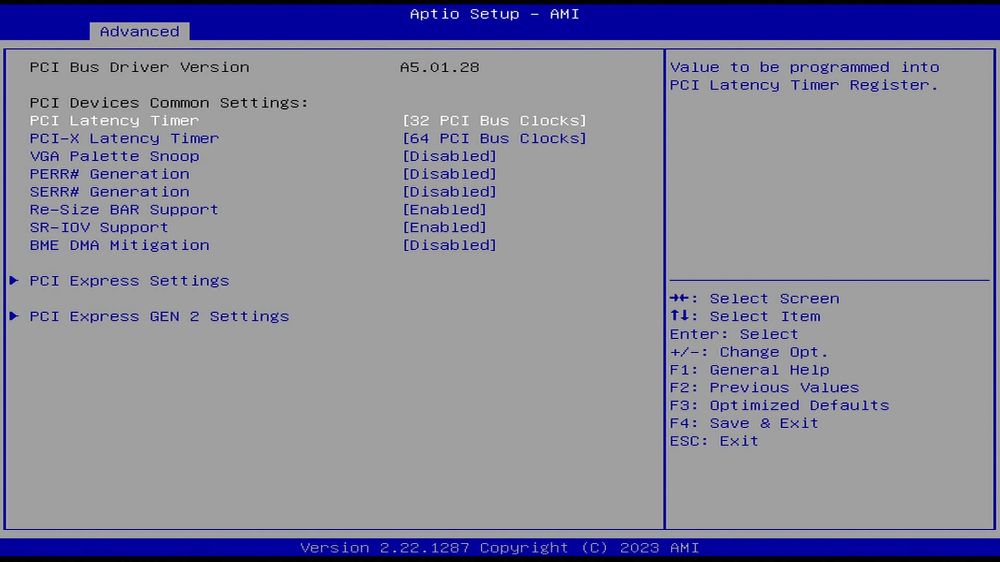
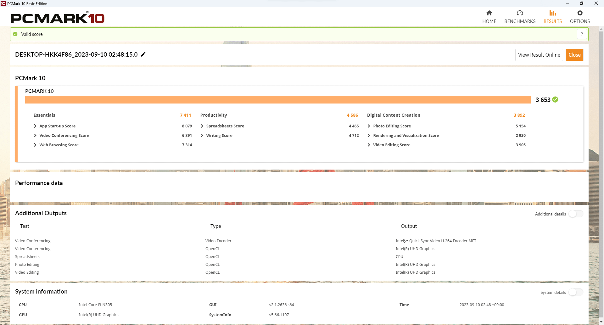

# R86S-N (N305A) レビュー

中国 GoWin Solution が製造する「R86S」という小型PCがあります。

手のひらサイズの小型PCながら2.5GbEが3ポート、10GbEが2ポートの豊富なネットワークインターフェースを備え、Intel x86 CPU搭載で多様なOSが動作可能、それでいて5万円台からという安さでホームサーバ、NAS、ソフトウェアルータなどの用途に最高と一部界隈で話題になりました。

+ [手のひらサイズの小型PCである「R86S」で夢の10GbE生活 (PC Watch)](https://pc.watch.impress.co.jp/docs/column/ubuntu/1505568.html)
+ [SFP+が付いている怪レいミニPC R86Sをレビューする (Zenn)](https://zenn.dev/yasnyan/articles/3b5681d8faeba7)

この「R86S」に Intel AlderLake-N プロセッサを搭載した新バージョン「R86S-N」が登場していたので、AliExpressで購入してみました。


## スペック

- CPU： Intel N100 (4C4T) / Intel Core i3-N305 (8C8T)
- メモリ： 8GB / 16GB (LPDDR5-4800)
- eMMC： 128GB
- M.2： M.2 2280 x 1 + M.2 2230 x1 (10GbEと排他)
- USB： USB3.2 Gen 1 Type-A x3 + USB3.2 Gen 2 Type-C x1 (DP出力可)
- I/O： microSD、HDMI、シリアル (USB Mini-B形状)
- LAN： 2.5GbE RJ-45 x3 (Intel I226-V) + 10GbE SFP+ x2 (Intel 82599)
- WLAN： Wi-Fi6 + BT5.2 (Intel AX201)
- 電源： 12V/4A USB-C形状

R86S-N シリーズにはスペック違いで3種類のモデルがありますが、違いはCPUとメモリ容量のみで、その他は共通となっているようです。

- N100A： Intel N100 + メモリ 8GB
- N100B： Intel N100 + メモリ 16GB
- N305A： Intel Core i3-N305 + メモリ 16GB

### R86Sとの違い

前モデルの R86S と R86S-N のスペック上の違いとして、CPUが JasperLake 世代から AlderLake-N 世代にアップグレードされ、メモリも LPDDR5 に高速化しました。

NICについては 2.5GbE RJ-45 x3 + 10GbE SFP+ x2 という構成に違いはないものの、2.5GbEのチップが Intel I225-V から Intel I226-V に、10GbEのチップが Mellanox Connect-X3 から Intel 82599 に変更されています。  

特に10GbEが Mellanox から Intel に変わった点については人によって好みが分かれるところかもしれません。

その他USB Type-Cが追加され、HDMIと合わせて2画面出力が可能になるなどインターフェース周りが強化されています。

電源入力はバレルコネクタからUSB Type-C形状のコネクタに変わっています。


## 購入

AliExpressで購入しました。アマゾンマーケットプレイスでも買えるようですが割高です。  
今回購入したのは最上位モデルの「N305A」で購入時の価格は75,127円でしたが、その後やや値上がりしているようです。

2023年8月の中ごろに注文して、手元に届くまで3週間ほどかかりました。


## 外観


外観は従来モデルのR86Sとほぼ同じのようです。一応注文時にカラー「Grey」を選択したのですが届いたものはどうみてもブラックです。

サイズは実測で W 83 mm x D 134 mm x H 41 mm (無線アンテナ部のぞく)  
一般的なミニPCと同程度のサイズ感です。

### 正面インターフェース


写真の左上から

- 電源入力 (12V、USB-C形状)
- USB 3.2 Gen 1 Type-A
- 2.5GbE RJ-45 x3
- 10GbE SFP+ x2

電源入力はUSB-Cの形をしていますが、USBポートとしては使用できないようです。電源については日本で使ううえで難点がある仕様となっています（後述）

### 側面インターフェース


写真の左から

- COMポート (USB Mini-B形状)
- USB 3.2 Gen 1 Type-A x2
- USB 3.2 Gen 2 Type-C
- HDMI
- TFカード(microSD)スロット
- 電源ボタン
- 電源LED

COMポートは今時珍しいUSB Mini-Bの形をしており、使用するにはなんらかの変換ケーブルを用意する必要がありそうです。

USB-CポートはDP-Altによる映像出力に対応しており、HDMIとあわせて2画面出力が可能です。ただしBIOS画面はHDMIでしか映りませんでした。

なお側面の各ポートは少し奥まっているため、ケーブルによってはしっかりとささらない場合がありました。特にUSB-Cポートは手元の3本中2本がダメでしたのでケーブル相性が厳しいです。  
(個体差もあるかもしれません)

### 底面インターフェース


底面のネジ止めされた裏蓋を外すと M.2 2280 空きスロットx1 があります。（写真は手持ちのM.2 SSDを装着しています）

M.2スロットにSSDを装着する場合、ヒートシンクが付いているタイプですと裏蓋と干渉する可能性が高いです。


### 下部モジュールの換装


本体は上部と下部がモナカ状に分かれる構造になっていて、下部モジュールを交換できるようになっています。標準で装着されているのは 10GbE x2 + M.2 2280 x1 を備えたモジュールですが、10GbEが無いかわりに M.2 2280 x1 + M.2 2230 x1 を備えた薄型モジュールも付属しています。

なお各部のネジは一般的なプラスネジではなく六角ネジ(H1.5)ですが、ドライバーが付属しているので持っていなくても大丈夫です。  
（ロゴ付きの妙にかっこいいドライバーが付属します）


## 電源について難あり

特に日本でR86S-Nを使用するにあたり、本機の電源まわりの仕様について少し悩ましい問題があります。

本機に付属するACアダプターの仕様は

- 入力側： A型コンセントプラグ / 220V-1.2A / 50-60Hz 
- 出力側： USB-Cコネクタ / 12V-4A 


プラグ形状こそ日本と同じA型ですが電圧は中国仕様の220Vで日本の100Vには対応していません。もちろんPSEマークもありませんので、安全性の面からも使用にはリスクが伴います。

出力側はUSB-Cですので、市販のUSB-PDアダプタが使用可能ではあるのですが、現在日本で販売されているUSB-PDアダプタはどれも12V-3Aが最大で、4A以上の出力に対応しているものは見たことがありません。

また、USB-PD規格での12V出力はオプション扱いなので、Ankerなど人気のUSB-PDアダプタでも12V出力に対応していないものがあります。12V非対応のAnker製USB-PD 65Wアダプタを繋いでみましたがやはり動作しませんでした。

よって本機を日本で使用するうえでの電源の選択肢としては、

1. 付属の中国仕様ACアダプタを使用する → 安全面のリスクあり
2. 12V-3A出力対応のUSB-PDアダプタを使用する → 電力不足による動作不良の可能性あり

の2択となります。

今回は12V-3A出力のUSB-PDアダプタを使用して動作確認を行っています。


## 発熱、動作音、消費電力

本機は金属製のボディで、ボディ自体がヒートシンクとなっているため動作中はかなり熱くなります。手で数秒以上は触れなくなる程度の熱さになります。

排熱は上部に小型の吸気ファンがあり、背面から排気されるようです。  
動作時はファンが常に回っていてそれなりの風切り音がしますが、低負荷時はそれほど大きな音はしません。動いていることは明確に分かりますがうるさいと感じるほどではありませんでした。

ただ高負荷時はファンの回転数が上がり、かなりの音がするようになります。ホームサーバ用途であっても寝室に置くのは難しいかと思います。

消費電力は電源入力にUSBワットチェッカーを挟み込んで計測したところ、アイドル時が10～12W程度、高負荷時には瞬間的に40Wを超えることもありました。  
10GbE未使用時の値なので、10GbEを使うともう少し上がりそうです。


## 無線の使用について(技適問題)

本機は Intel AX201 による Wi-Fi6 + Bluetooth 5.2 を備えていますが、日本国内で使用するために必要となる技適マーク表示は確認できませんでした。そのため、原則として無線は使用できません。

今回レビューにあたり本体無線アンテナは取り外したうえで Wi-Fi および Bluetooth はOS上で無効化し一切使用していませんが、念のため「[技適未取得機器を用いた実験等の特例制度](https://www.tele.soumu.go.jp/j/sys/others/exp-sp/)」による届出を行いました。（届出番号：01-20230910-03-470438）


## BIOSの確認

電源を入れてR86Sのロゴが表示されている間にDELキーでBIOS設定画面に入れます。  
BIOSはごく一般的なAMI BIOSで、設定項目のロックもほぼされていないようです。

CPUのPL1、PL2は標準通りの値が設定されています。試してはいませんが変更もできそうでした。

- PL1： 15.0W
- PL2： 35.0W





## Windows 11 をインストール

デフォルトでは内蔵eMMCに「iStoreOS」なるOSがインストールされていました。OpenWrt系の中国製OSのようですが当然使うつもりはありませんのでスルーします。


R86S-N を使用する方は Ubuntu や OpenWrt などをインストールする場合が多そうですが今回は Windows 11 22H2 を入れて動作確認することにしました。  

なお、後述しますがドライバサポートの関係上、R86S-Nと Windows 11 は相性が悪いです。Windows系を入れるのであれば Windows 10 か Windows Server のほうが良いでしょう。

OSインストール自体は特に注意することはありません。今回は内蔵eMMCではなくM.2 SSDにインストールしました。

Windows 11 の標準ドライバではNICが認識されないため、USBメモリ等で[Intel ネットワークドライバ](https://www.intel.co.jp/content/www/jp/ja/download/727998)をコピーしてインストールします。これで2.5GbE I226-V が認識されるため、インターネットに接続してWindows Updateをかければ大体のドライバが入ります。

それでも10GbEのドライバが入らず認識しません。これは Intel 82599 が Windows 11 でサポートされていないという罠があるためです。そのため Windows 10 用のドライバを入れる必要があります。

[Intel イーサネット アダプター完全ドライバー パック](https://www.intel.co.jp/content/www/jp/ja/download/15084/intel-ethernet-adapter-complete-driver-pack.html)をダウンロードしてZIPを展開し、`PROXGB\Winx64\NDIS68\ixn68x64.inf` をインストールすることで認識するようになります。


## ベンチマーク

簡単にベンチマークを取りました。すべて Windows 11 環境で、PL1/PL2は標準設定です。

### CrystalDiskMark

+ 内蔵eMMC

  

  eMMCというと遅いイメージがありますが、本機はシーケンシャル/ランダムともに十分高速です。OSディスクとして使って問題ないでしょう。

+ M.2 SSD (WD Blue SN550 500GB)

  

  テストに使用したSSD SN550 (PCIe 3.0 x4)は公称シーケンシャルリード 2,400 MB/sですが、全くそれに及ばない結果となっています。

  これは本機のM.2 2280スロットが PCIe 3.0 x1レーンしかないためで、高速SSDのスペックを100%引き出せる仕様ではないことは注意が必要です。

  それでも内蔵eMMCよりは高速ですので本機をNAS用途にする場合は大容量SSDを装着してデータ領域としましょう。

### PCMark 10 Basic



- Total： 3653
- Essentials： 7413
- Productivity： 4586
- Digital Content Creation： 3892

### CineBench 2024


- CPU (Multi Core)： 325pt
- CPU (Single Core)： 66pt

ベンチマーク実行中のCPU温度はおおむね70℃前後で、最大でも80℃程度でした。サーマルスロットルは発生していませんがパワーリミットにひっかかっていたのでPL1を少し引き上げるともっと性能が出る気がします。

### ネットワークベンチマーク

R86S-Nの10GbE SFP+インターフェースにSFP-Tモジュールを接続し、サーバ側の10GBase-TインターフェースとCAT7のLANケーブルで直結した状態で帯域幅を計測しました。設定はドライバの標準状態のままとしています。  
(TCPオフロード:有効、ジャンボフレーム:無効、送受信バッファ:512、フロー制御:有効)


#### iPerf3

```
C:\iperf-3.1.3-win64>iperf3.exe -c 192.168.31.10 -P 10
- - - - - - - - - - - - - - - - - - - - - - - - -
[ ID] Interval           Transfer     Bandwidth
[  4]   0.00-10.00  sec  1.10 GBytes   943 Mbits/sec                  sender
[  4]   0.00-10.00  sec  1.10 GBytes   942 Mbits/sec                  receiver
[  6]   0.00-10.00  sec  1.10 GBytes   943 Mbits/sec                  sender
[  6]   0.00-10.00  sec  1.10 GBytes   943 Mbits/sec                  receiver
[  8]   0.00-10.00  sec   986 MBytes   828 Mbits/sec                  sender
[  8]   0.00-10.00  sec   986 MBytes   827 Mbits/sec                  receiver
[ 10]   0.00-10.00  sec   979 MBytes   821 Mbits/sec                  sender
[ 10]   0.00-10.00  sec   978 MBytes   821 Mbits/sec                  receiver
[ 12]   0.00-10.00  sec   974 MBytes   817 Mbits/sec                  sender
[ 12]   0.00-10.00  sec   973 MBytes   817 Mbits/sec                  receiver
[ 14]   0.00-10.00  sec   976 MBytes   819 Mbits/sec                  sender
[ 14]   0.00-10.00  sec   976 MBytes   818 Mbits/sec                  receiver
[ 16]   0.00-10.00  sec   959 MBytes   804 Mbits/sec                  sender
[ 16]   0.00-10.00  sec   959 MBytes   804 Mbits/sec                  receiver
[ 18]   0.00-10.00  sec   996 MBytes   835 Mbits/sec                  sender
[ 18]   0.00-10.00  sec   995 MBytes   835 Mbits/sec                  receiver
[ 20]   0.00-10.00  sec   954 MBytes   800 Mbits/sec                  sender
[ 20]   0.00-10.00  sec   954 MBytes   800 Mbits/sec                  receiver
[ 22]   0.00-10.00  sec   990 MBytes   830 Mbits/sec                  sender
[ 22]   0.00-10.00  sec   990 MBytes   830 Mbits/sec                  receiver
[SUM]   0.00-10.00  sec  9.83 GBytes  8.44 Gbits/sec                  sender
[SUM]   0.00-10.00  sec  9.82 GBytes  8.44 Gbits/sec                  receiver

iperf Done.
```

並列数10で 8.44 Gbps という結果で、理論値 10 Gbps にはやや及ばない結果となりました。  
なお、MTUを9000まで上げたり送受信バッファを増やしたりしてみても結果はほとんど変わりませんでした。

#### NTTTCP

Microsoft製のネットワーク帯域ベンチマークツールです。  
https://github.com/microsoft/ntttcp

```
C:\NTTTCP>ntttcp.exe -s -m 8,*,192.168.31.10 -t 30
Copyright Version 5.39
Network activity progressing...


Thread  Time(s) Throughput(KB/s) Avg B / Compl
======  ======= ================ =============
     0   30.002       120147.723     65536.000
     1   30.002       118319.579     65536.000
     2   30.002       120339.711     65536.000
     3   30.002       219703.753     65536.000
     4   30.002       120256.516     65536.000
     5   30.002       219825.345     65536.000
     6   30.002       120937.004     65536.000
     7   30.002       118571.295     65536.000


#####  Totals:  #####


   Bytes(MEG)    realtime(s) Avg Frame Size Throughput(MB/s)
================ =========== ============== ================
    33931.000000      30.004       1459.983         1130.887


Throughput(Buffers/s) Cycles/Byte       Buffers
===================== =========== =============
            18094.187       0.208    542896.000


DPCs(count/s) Pkts(num/DPC)   Intr(count/s) Pkts(num/intr)
============= ============= =============== ==============
    15232.492         6.278       35183.038          2.718


Packets Sent Packets Received Retransmits Errors Avg. CPU %
============ ================ =========== ====== ==========
    24369617          2869275           0      0      3.092
```

8スレッド実行30秒間で 1130.887 MB/s (= 9.05 Gbps) という結果が得られました。  
なお、MTUを9000まで上げた場合には 9.4 Gbps 程度の結果が出ることも確認しました。
